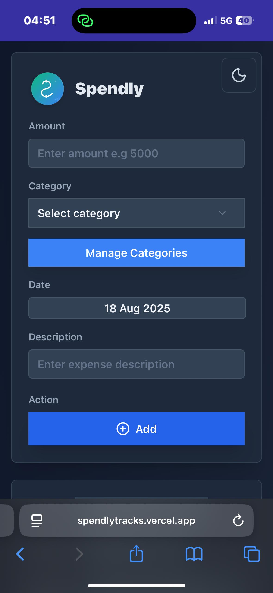
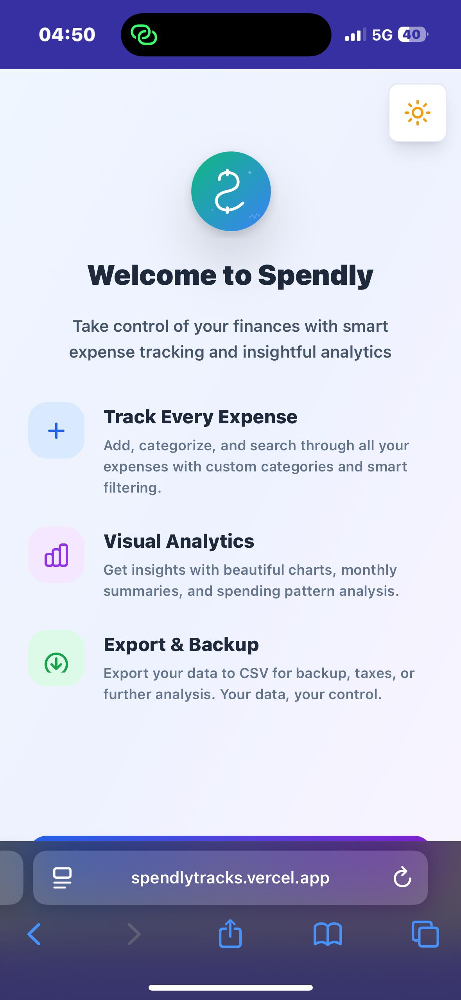
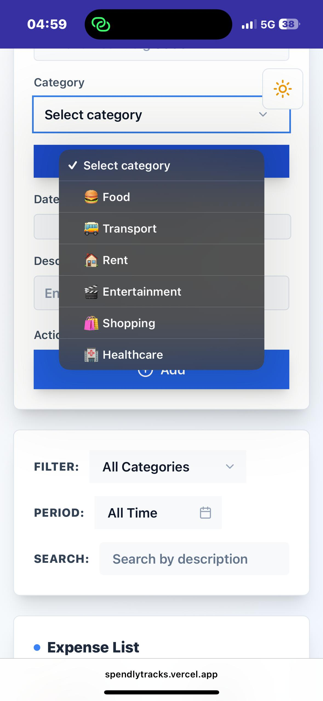
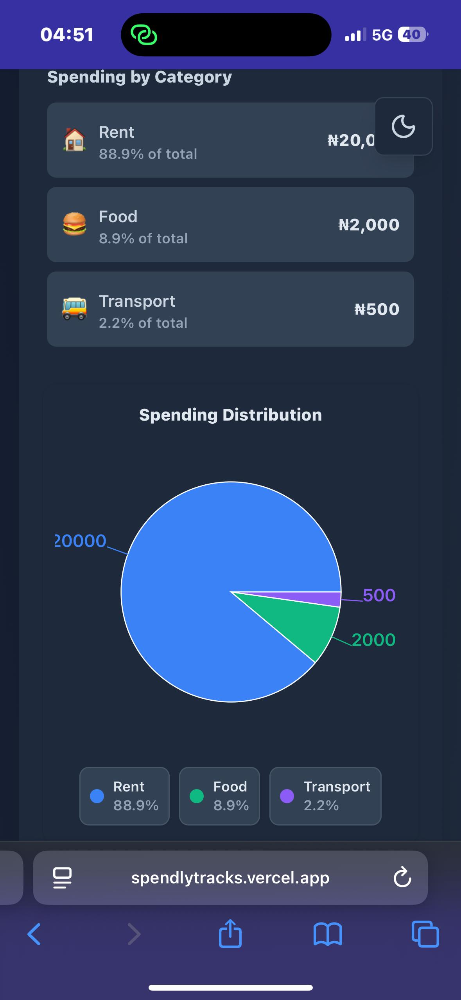
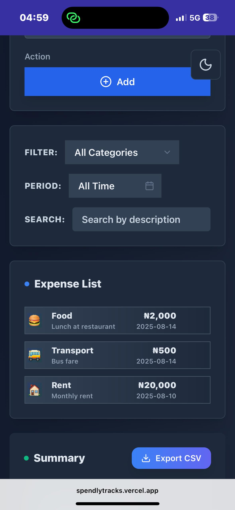
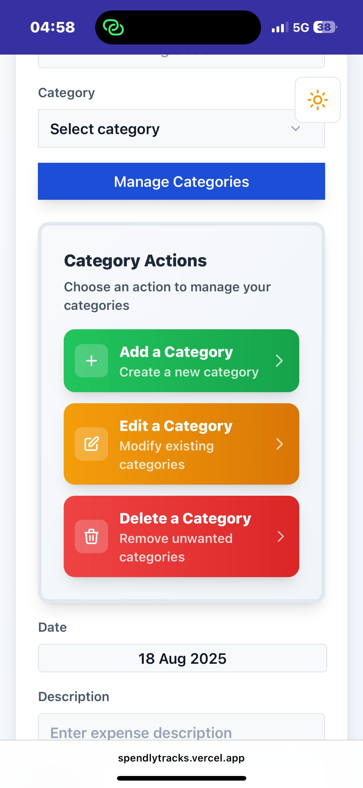

# 💰 Spendly


A minimalist finance tracker that helps you stay on top of your expenses with ease.  
Track, visualize, and manage your spending — all in one simple dashboard.

---

## ✨ Features

- ✅ Add and delete expenses  
- ✅ Custom categories (create, edit, delete)  
- ✅ Filter by category  
- ✅ Search by description  
- ✅ Dark / Light mode 🌗  
- ✅ Date tracking  
- ✅ Monthly summary  
- ✅ Pie chart visualization of spending  
- ✅ Export expenses as CSV  
- ✅ Onboarding page for first-time users  

---

## 📸 Screenshots

>## 📸 Screenshots  

### 🟢 Onboarding  
  


### 🟢 Add Expense  
  

### 🟢 Categories & Filters  
  

### 🟢 Light mode  
 

### 🟢 Filters 
 

### 🟢 Pie chart 
 

### 🟢 Expense List 
 

### 🟢 Manage Categories 
 

---

## 🛠 Tech Stack

- *React* – Frontend framework  
- *LocalStorage* – Data persistence  
- *Recharts* – Data visualization  
- *Tailwind CSS* – Styling   

---

## 🚀 Live Demo

👉 [Spendly Live Demo](https://spendlytracks.vercel.app/)  

---

## ⚡ Installation

1. Clone the repo
   ```bash
   git clone https://github.com/blaqboydee/spendly.git
   cd spendly


   📖 Usage
	1.	Add a new expense with description, amount, and category
	2.	Create your own custom categories (edit or delete later)
	3.	Filter or search expenses
	4.	View monthly summary + pie chart visualization
	5.	Export your expenses to CSV anytime
	6.	Switch between Dark and Light mode 🌗

⸻

🗺 Future Improvements
	•	🔑 User authentication
	•	☁ Cloud sync for data
	•	📊 Budget alerts & goals
	•	📱 Mobile app version

⸻

🤝 Contributing

Contributions are welcome!
Fork this repo and submit a pull request if you’d like to improve Spendly.

⸻

📄 License

This project is licensed under the MIT License.